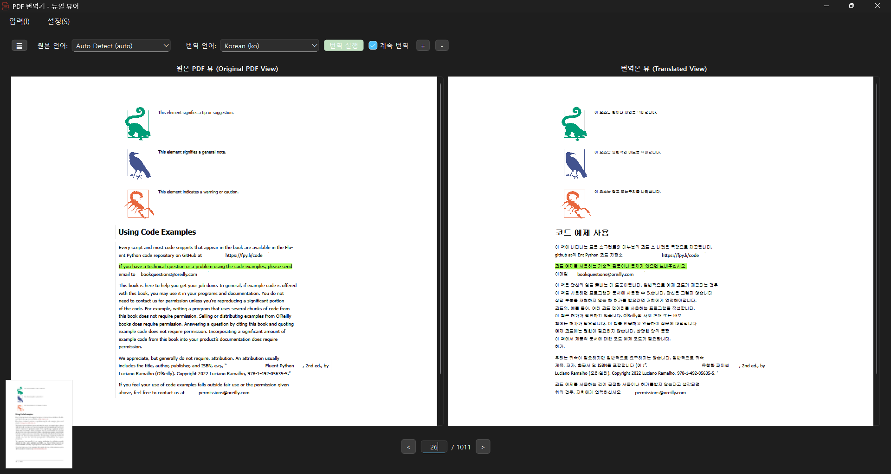
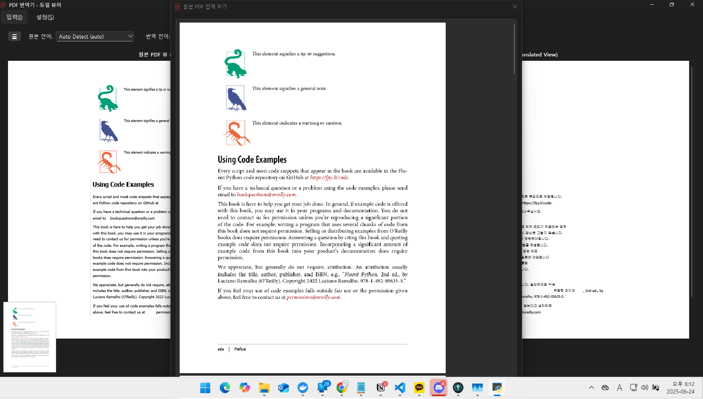
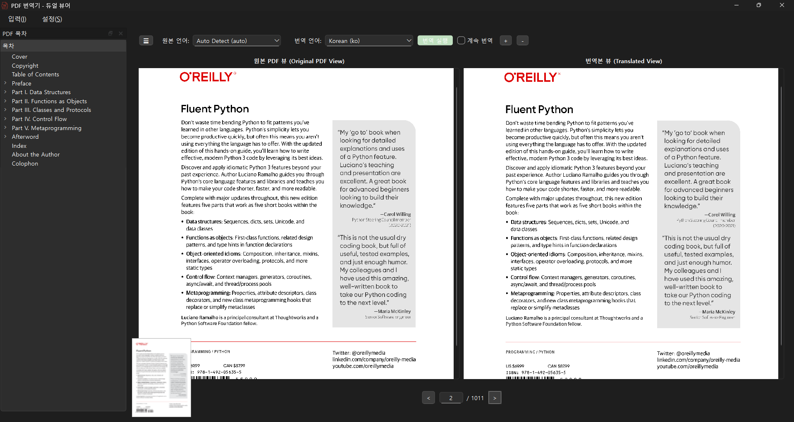

# 📄 PDF Dual Viewer & Translator

[[English](README.md)] [[한국어](README_ko.md)]

## 📝 Project Overview

This project is a desktop application that provides a dual-view (original/translated) PDF viewer, page navigation, highlight synchronization, translation integration, and style/layout preservation. It is built with PySide6, PyMuPDF, and follows a clean architecture design.

## 🖼️ Screenshots

| Main View | Thumbnail Preview | Table of Contents View |
|---|---|---|
|  |  |  |

- **Main View**: Default dual PDF viewer and translator screen.
- **Thumbnail Preview**: When clicking the bottom-left thumbnail, shows a preview of page 10.
- **Table of Contents View**: Main view with the left-side table of contents (outline) panel open.

## 📂 Folder Structure

```
src/
├─adapters/           # Controllers, gateways, presenters
├─common/             # Common utilities/constants
├─core/               # Entities, use cases (business logic)
│  └─use_cases/
├─infrastructure/     # PDF parsing, translation, DB, etc.
│  ├─dtos/
│  ├─pdf_parsing/
│  ├─persistence/
│  └─translation/
└─ui/                 # PySide6-based UI, widgets, resources
    ├─resources/
    └─widgets/
main.py               # Application entry point
pyproject.toml        # Dependencies & settings
README.md             # English documentation
README_ko.md          # Korean documentation
```

## 🚀 How to Run

1. Install [uv](https://github.com/astral-sh/uv) (a fast Python package manager)
2. Add dependencies:
   ```cmd
   uv add pyside6 pymupdf
   ```
3. Run the app:
   ```cmd
   uv run main.py
   ```

## ✨ Features
- Open PDF files and display in dual view (original/translated)
- Page navigation and direct page input
- Synchronized highlighting (both views)
- Translation API integration
- Style/layout preservation, image rendering
- Clean architecture structure

## 🛠️ Tech Stack
- Python 3.10+
- PySide6 (Qt-based GUI)
- PyMuPDF (PDF parsing)
- Others: Clean Architecture, MVC, etc.

## 📌 Reference & Contribution
- For detailed design, see design.md
- PRs/issues/contributions are welcome!
