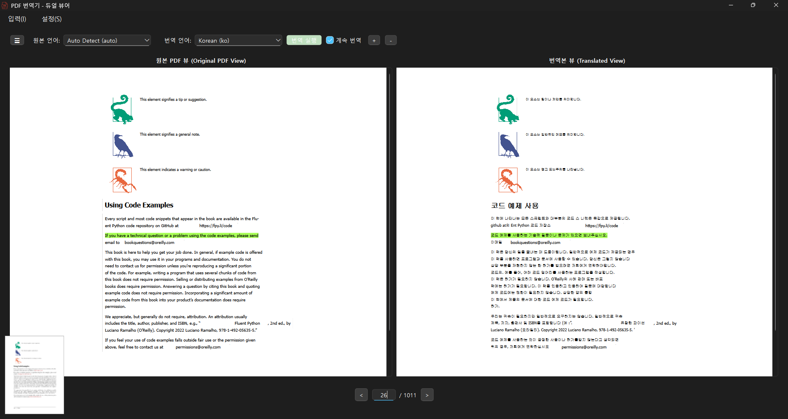
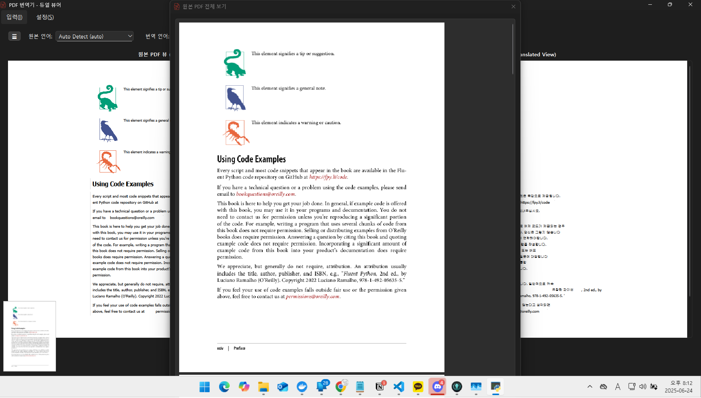

# 📄 PDF 듀얼 뷰어 및 번역기

[[영어](README.md)] [[한국어](README_ko.md)]

## 📝 프로젝트 개요

이 프로젝트는 듀얼 뷰(원본/번역본) PDF 뷰어, 페이지 탐색, 강조 표시 동기화, 번역 통합, 스타일/레이아웃 유지 기능을 제공하는 데스크톱 애플리케이션입니다. PySide6, PyMuPDF를 기반으로 구축되었으며, 클린 아키텍처 디자인을 따릅니다.

## 🖼️ 스크린샷

| 실행 화면 | 섬네일 미리보기 | 목차 뷰어 |
|---|---|---|
|  |  |  |

- **실행 화면**: 기본화면으로 pdf와 번역본 화면을 제공합니다.
- **섬네일 미리보기**: 좌측 하단의 섬네일을 클릭했을 때 10장의 미리보기를 제공합니다.
- **목차 뷰어**: 메인화면의 좌측 사이드바에 해당 문서의 목차를 제공합니다.

## 📂 폴더 구조

```
src/
├─adapters/ # 컨트롤러, 게이트웨이, 프리젠터
├─common/ # 공통 유틸리티/상수
├─core/ # 엔티티, 사용 사례(비즈니스 로직)
│ └─use_cases/
├─infrastructure/ # PDF 파싱, 변환, DB 등
│ ├─dtos/
│ ├─pdf_parsing/
│ ├─persistence/
│ └─translation/
└─ui/ # PySide6 기반 UI, 위젯, 리소스
├─resources/
└─widgets/
main.py # 애플리케이션 진입점
pyproject.toml # 종속성 및 설정
README.md # 영어 문서
README_ko.md # 한국어 문서
```

## 🚀 실행 방법

1. [uv](https://github.com/astral-sh/uv) (빠른 Python 패키지 관리자) 설치
2. 종속성 추가:
```cmd
uv add pyside6 pymupdf
```
3. 앱 실행:
```cmd
uv run main.py
```

## ✨ 기능
- PDF 파일 열기 및 이중 보기(원본/번역본) 표시
- 페이지 탐색 및 직접 페이지 입력
- 동기화된 강조 표시(두 보기 모두)
- 번역 API 통합
- 스타일/레이아웃 유지, 이미지 렌더링
- 클린 아키텍처 구조

## 🛠️ 기술 스택
- Python 3.10 이상
- PySide6 (Qt 기반 GUI)
- PyMuPDF (PDF 파싱)
- 기타: 클린 아키텍처, MVC 등

## 📌 참조 및 기여
- 자세한 디자인은 design.md를 참조하세요.
- 홍보/이슈/기여를 환영합니다!
